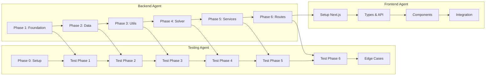

# Satisfactory Factory Calculator - Migration & Modularization Plan

> **Version**: 2.0  
> **Last Updated**: 2026-02-02  
> **Status**: In Planning

---

## Executive Summary

This project restructures the Satisfactory Factory Calculator with two main objectives:

1. **Backend Modularization**: Refactor monolithic Flask `app.py` (1475 lines) into clean modules
2. **Frontend Migration**: Migrate frontend from vanilla JS to React/Next.js

Key design decisions:
- **Flask stays** - Backend remains Python/Flask
- **Stateless API** - No server-side recipe state; all config via request params
- **Sequential testing** - Tests written AFTER each backend phase to prevent conflicts

---

## Agent Workflow



**Coordination Rules:**
1. Backend Agent works on Phase N
2. Backend Agent commits and signals completion
3. Testing Agent writes tests for Phase N
4. Backend Agent proceeds to Phase N+1
5. Frontend Agent starts after Backend Phase 6 is tested

---

## API Design (Stateless)

The API is fully stateless. Active recipe state is NOT stored on the server.

### Endpoints

| Method | Endpoint | Purpose |
|--------|----------|---------|
| GET | `/api/health` | Health check |
| GET | `/api/items` | Get all items (static) |
| GET | `/api/recipes` | Get all recipes with default active status |
| POST | `/api/calculate` | Calculate production (all config in body) |

### Removed Endpoints

| Endpoint | Reason |
|----------|--------|
| ~~POST /api/active-recipes~~ | State should be client-side |
| ~~GET /api/active-recipes~~ | Use GET /api/recipes instead |

See [docs/API.md](API.md) for complete API documentation.

---

## Current → Target Architecture

### Current (Monolithic)

```
backend/
├── app.py              # 1475 lines - EVERYTHING
├── calculation/
│   └── puLP_calc_v1.py # 126 lines - incomplete
└── data1.0.json
```

### Target (Modular)

```
backend/
├── app.py              # ~50 lines - factory only
├── config.py           # Constants
├── routes/
│   ├── health.py
│   ├── items.py
│   ├── recipes.py
│   └── calculate.py
├── services/
│   ├── recipe_service.py
│   ├── calculation_service.py
│   └── summary_service.py
├── solvers/
│   ├── milp_solver.py
│   ├── strategy_weights.py
│   ├── dependency_graph.py
│   └── graph_builder.py
├── data/
│   ├── loader.py
│   ├── items.py
│   ├── recipes.py
│   └── base_resources.py
├── utils/
│   ├── math_helpers.py
│   └── machine_helpers.py
├── tests/
│   ├── unit/
│   ├── integration/
│   └── test_edge_cases.py
└── data1.0.json
```

---

## Task Documents

| Document | Owner | Focus |
|----------|-------|-------|
| [BACKEND_TASKS.md](tasks/BACKEND_TASKS.md) | Backend Agent | Modularizing Flask code |
| [TESTING_TASKS.md](tasks/TESTING_TASKS.md) | Testing Agent | Tests for backend phases |
| [FRONTEND_TASKS.md](tasks/FRONTEND_TASKS.md) | Frontend Agent | React/Next.js migration |

---

## Phase Timeline

| Week | Backend Agent | Testing Agent | Frontend Agent |
|------|---------------|---------------|----------------|
| 1 | Phases 1-3 | Setup + Tests 1-3 | - |
| 2 | Phases 4-6 | Tests 4-6 | Setup |
| 3 | Bug fixes | Edge cases | Components |
| 4 | - | - | Integration |

---

## Success Criteria

### Backend
- [ ] `app.py` < 60 lines
- [ ] 15+ separate module files
- [ ] API matches documentation
- [ ] Fully stateless (no POST /api/active-recipes)
- [ ] Gunicorn works unchanged

### Testing  
- [ ] 80%+ backend coverage
- [ ] All 8 edge case items pass
- [ ] Performance benchmarks pass
- [ ] No flaky tests

### Frontend
- [ ] TypeScript with no `any`
- [ ] All current features working
- [ ] Mobile responsive
- [ ] Graph renders correctly

---

## Edge Case Items (Endgame Proof)

These items must all calculate successfully to prove production readiness:

| Item | Why Critical |
|------|--------------|
| Nuclear Pasta | Deepest dependency tree |
| Thermal Propulsion Rocket | Many alternates |
| Assembly Director System | Complex electronics |
| Magnetic Field Generator | Resource diversity |
| Fused Modular Frame | Potential circular deps |
| Turbo Motor | Resource intensive |
| Supercomputer | Multiple paths |
| AI Limiter | Alternate impact |

---

## Risks & Mitigations

| Risk | Mitigation |
|------|------------|
| MILP solver extraction breaks | Keep original working until verified |
| Agent conflicts on same file | Clear phase boundaries |
| Tests break during refactor | Tests run after phase complete |
| Frontend can't connect | Keep Flask routes compatible |

---

## Communication Protocol

1. **Phase complete**: Commit with `[BACKEND] Phase N complete: description`
2. **Tests ready**: Commit with `[TESTING] Phase N tests: X passed`
3. **Blocking issue**: Update task doc with `[!]` and describe issue
4. **API change**: Update docs/API.md BEFORE implementing
