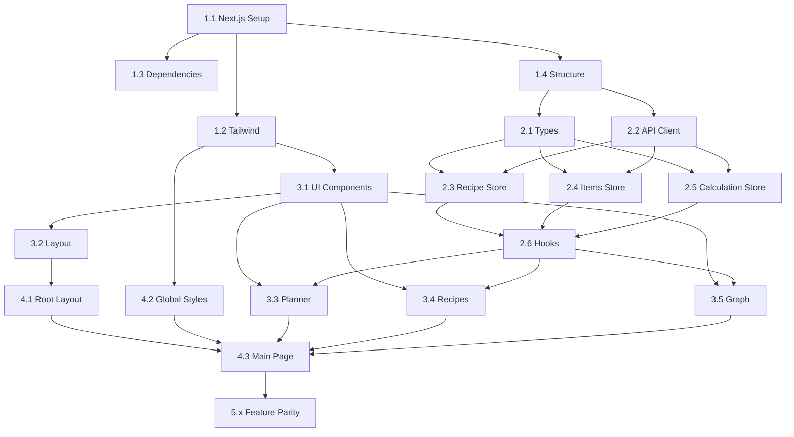

# Frontend Tasks - Satisfactory Factory Calculator

> **Owner**: Frontend Agent  
> **Status**: In Progress (Phase 4)  
> **Dependencies**: Backend modularization should be mostly complete to ensure API stability

---

## Overview

This document contains the comprehensive task list for migrating the frontend from vanilla JavaScript (embedded in HTML) to a React/Next.js application with TypeScript.

---

## Task Legend

- `[ ]` Not started
- `[/]` In progress
- `[x]` Complete
- `[!]` Blocked
- `[?]` Needs clarification

**Priority Levels**: 🔴 Critical | 🟠 High | 🟡 Medium | 🟢 Low

---

## Phase 1: Project Setup

### 1.1 Initialize Next.js Project 🔴

- [x] Create Next.js project with TypeScript
  ```bash
  cd frontend
  npx -y create-next-app@latest . --typescript --tailwind --eslint --app --src-dir
  ```
- [x] Configure `next.config.js` for API proxy to Flask
- [x] Set up environment variables (`.env.local`)
- [x] Configure path aliases in `tsconfig.json`

**Acceptance Criteria**:
- Project builds successfully
- API proxy works with Flask backend
- Path aliases resolve correctly

---

### 1.2 Configure Tailwind CSS 🔴

**File**: `tailwind.config.js`

- [x] Set up custom color palette matching current design
- [x] Configure dark mode (class-based)
- [x] Add custom breakpoints if needed
- [x] Set up CSS variables for dynamic theming

**Current CSS Variables to Migrate** (from `index.html`):
```css
--md-hue: 220;
--bg: hsl(var(--md-hue), 20%, 10%);
--surface: hsl(var(--md-hue), 18%, 14%);
--surface-high: hsl(var(--md-hue), 16%, 20%);
--primary: hsl(var(--md-hue), 80%, 60%);
--on-primary: #fff;
--accent: hsl(calc(var(--md-hue) + 30), 70%, 55%);
--text: #e0e0e0;
--text-dim: #999;
```

---

### 1.3 Install Dependencies 🔴

- [x] Install vis-network: `npm install vis-network`
- [x] Install elkjs: `npm install elkjs`
- [x] Install zustand: `npm install zustand`
- [x] Install dev dependencies for testing

**Package.json Dependencies**:
```json
{
  "dependencies": {
    "next": "^14.0.0",
    "react": "^18.2.0",
    "react-dom": "^18.2.0",
    "vis-network": "^9.1.0",
    "elkjs": "^0.8.0",
    "zustand": "^4.4.0"
  },
  "devDependencies": {
    "typescript": "^5.0.0",
    "@types/react": "^18.2.0",
    "@types/node": "^20.0.0",
    "vitest": "^1.0.0",
    "@testing-library/react": "^14.0.0",
    "@playwright/test": "^1.40.0"
  }
}
```

---

### 1.4 Set Up Project Structure 🔴

- [x] Create `src/components/` directory structure
- [x] Create `src/hooks/` directory
- [x] Create `src/stores/` directory
- [x] Create `src/lib/` directory
- [x] Create `src/types/` directory
- [x] Copy images from `frontend/images/` to `public/images/`

---

## Phase 2: Core Infrastructure

### 2.1 TypeScript Types 🔴

**File**: `src/types/index.ts`

- [x] Define `Item` interface
- [x] Define `Ingredient` and `Product` interfaces
- [x] Define `Recipe` interface
- [x] Define `RecipeNode` interface
- [x] Define `ProductionGraph` interface
- [x] Define `CalculateRequest` interface
- [x] Define `CalculateResponse` interface
- [x] Define `ProductionSummary` interface
- [x] Define `OptimizationStrategy` type
- [x] Define `StrategyWeights` interface
- [x] Export all types

**Acceptance Criteria**:
- Types match API documentation exactly
- No `any` types in core interfaces
- Types are reused throughout codebase

See `docs/API.md` for type definitions to implement.

---

### 2.2 API Client 🔴

**File**: `src/lib/api.ts`

- [x] Create `ApiClient` class
- [x] Implement `get<T>(endpoint)` method
- [x] Implement `post<T>(endpoint, body)` method
- [x] Add error handling with typed errors
- [x] Configure base URL from environment
- [x] Export singleton instance (Mock support)

**Acceptance Criteria**:
- All API calls go through this client
- Errors are properly typed
- Loading states can be tracked

---

### 2.3 Recipe Store 🔴

**File**: `src/stores/recipeStore.ts`

- [x] Create Zustand store with persist middleware
- [x] Implement `recipes` state (Record<string, Recipe>)
- [x] Implement `activeRecipes` state (Record<string, boolean>)
- [x] Implement `isLoading` state
- [x] Implement `setRecipes(recipes)` action
- [x] Implement `toggleRecipe(recipeId)` action
- [x] Implement `setRecipeActive(recipeId, active)` action
- [x] Implement `enableAll()` action
- [x] Implement `disableAlternates()` action
- [x] Persist to localStorage

**Acceptance Criteria**:
- State persists across page reloads
- Actions update state correctly
- TypeScript types are enforced

---

### 2.4 Items Store 🟠

**File**: `src/stores/itemStore.ts`

- [x] Create Zustand store
- [x] Implement `items` state (Record<string, Item>)
- [x] Implement `isLoading` state
- [x] Implement `fetchItems()` action
- [x] Implement `getItem(itemId)` selector
- [x] Implement `getItemName(itemId)` selector

---

### 2.5 Calculation Store 🟠

**File**: `src/stores/calculationStore.ts`

- [x] Create Zustand store
- [x] Implement `result` state (CalculateResponse | null)
- [x] Implement `isCalculating` state
- [x] Implement `error` state
- [x] Implement `targetItem` state
- [x] Implement `targetAmount` state
- [x] Implement `strategy` state
- [x] Implement `calculate()` action
- [x] Implement `clearResult()` action

---

### 2.6 Custom Hooks 🟠

**Files**: `src/hooks/`

- [x] Create `useItems()` hook
- [x] Create `useRecipes()` hook
- [x] Create `useCalculation()` hook
- [x] Create `useTheme()` hook
- [x] Create `useToast()` hook

**Acceptance Criteria**:
- Hooks encapsulate store access
- Loading states are handled
- Error states are handled

---

## Phase 3: UI Components

### 3.1 Base UI Components 🟠

**Directory**: `src/components/ui/`

#### Button Component
**File**: `Button.tsx`

- [x] Create `Button` component with variants (primary, secondary, ghost)
- [x] Add loading state with spinner
- [x] Add disabled state styling
- [x] Add size variants (sm, md, lg)

#### Input Component
**File**: `Input.tsx`

- [x] Create `Input` component
- [x] Add label support
- [x] Add error state
- [x] Add size variants (sm, md, lg)

#### Select Component
**File**: `Select.tsx`

- [x] Create `Select` component
- [x] Add option grouping support
- [x] Add search/filter support
- [x] Style dropdown

#### Toggle Component
**File**: `Toggle.tsx`

- [x] Create `Toggle` component for recipe on/off
- [x] Add animation
- [x] Add disabled state

#### Toast Component
**File**: `Toast.tsx`

- [x] Create `Toast` component
- [x] Add variants (success, error, info)
- [x] Add auto-dismiss
- [x] Create `ToastProvider` and `useToast` hook

#### Tooltip Component
**File**: `Tooltip.tsx`

- [x] Create `Tooltip` component (implemented for Graph)
- [x] Position intelligently (no overflow)
- [x] Support hover and click triggers

---

### 3.2 Layout Components 🟠

**Directory**: `src/components/layout/`

#### Sidebar Component
**File**: `Sidebar.tsx`

- [x] Create collapsible sidebar
- [x] Add responsive behavior (drawer on mobile)
- [x] Include logo and navigation
- [x] Add collapse toggle button

**Current Layout** (from `index.html`):
```html
<aside id="sidebar" class="sidebar">
  <!-- Controls go here -->
</aside>
```

#### Header Component
**File**: `Header.tsx`

- [x] Create header with title
- [x] Add theme toggle button
- [x] Add mobile menu button

#### TabPanel Component
**File**: `TabPanel.tsx`

- [x] Create tab navigation component
- [x] Support "Planner" and "Recipes" tabs
- [x] Add animated tab indicator
- [x] Handle tab switching

---

### 3.3 Planner Components 🔴

**Directory**: `src/components/planner/`

#### ItemSelector Component
**File**: `ItemSelector.tsx`

- [x] Create searchable dropdown for items
- [x] Add item icons
- [x] Group items by category (if available)
- [x] Filter as user types

**Current Implementation** (from `index.html`):
```javascript
function populateItemSelector() {
    const container = document.getElementById('item-selector-content');
    // ... filtering and displaying items
}
```

#### StrategySelector Component
**File**: `StrategySelector.tsx`

- [x] Create dropdown for optimization strategies
- [x] Add tooltips/explanations
- [x] Handle custom strategy (show weight inputs)

#### AmountInput Component
**File**: `AmountInput.tsx`

- [x] Create number input for target amount (merged in PlannerPanel)
- [x] Add validation (> 0)

#### CalculateButton Component
**File**: `CalculateButton.tsx`

- [x] Create primary action button (merged in PlannerPanel)
- [x] Show loading state during calculation

#### PlannerPanel Component
**File**: `PlannerPanel.tsx`

- [x] Compose all planner components
- [x] Handle form submission
- [x] Display summary after calculation

---

### 3.4 Recipe Components 🟠

**Directory**: `src/components/recipes/`

#### RecipeCard Component
**File**: `RecipeCard.tsx`

- [x] Display recipe name and machine
- [x] Show ingredients and products with icons
- [x] Add toggle for active/inactive
- [x] Highlight alternate recipes

**Current Implementation** (from `index.html`):
```javascript
function populateRecipeList() {
    // ... creating recipe cards with toggle
}
```

#### RecipeList Component
**File**: `RecipeList.tsx`

- [x] Render list of RecipeCard components
- [x] Support filtering (Name, Machine, Alternates)

#### RecipeFilters Component
**File**: `RecipeFilters.tsx`

- [x] Search by name
- [x] Filter by machine type
- [x] Toggle alternate-only view
- [x] Bulk enable/disable buttons

#### RecipesPanel Component
**File**: `RecipesPanel.tsx`

- [x] Compose RecipeFilters and RecipeList
- [x] Handle filter state
- [x] Show recipe count

#### RecipeBook Component (Full Page)
**File**: `RecipeBook.tsx`

- [x] Create full-page grid layout for recipes
- [x] Implement advanced filtering and stats summary
- [x] Add dual-mode navigation in Header

---

### 3.5 Graph Components 🔴

**Directory**: `src/components/graph/`

#### ProductionGraph Component
**File**: `ProductionGraph.tsx`

- [x] Initialize vis-network in useEffect
- [x] Convert API data to vis nodes/edges
- [x] Apply ELK layout
- [x] Handle node click events
- [x] Handle hover events for tooltips
- [x] Clean up network on unmount

**Current Implementation** (from `index.html`):
```javascript
function createNetwork(data) {
    const container = document.getElementById('production-graph');
    // ... creating vis network with ELK layout
}
```

#### GraphNode Component (Virtual)
**File**: `GraphNode.tsx`

- [x] Define node rendering logic (Recipe, Resource, Alternate, Surplus, End Product)

#### GraphTooltip Component
**File**: `GraphTooltip.tsx`

- [x] Show on node hover
- [x] Display recipe details and machine
- [x] Show inputs/outputs with rates and icons

#### GraphControls Component
**File**: `GraphControls.tsx`

- [x] Add zoom in/out buttons
- [x] Add fit-to-view button

#### GraphStats Component
**File**: `GraphStats.tsx`

- [x] Display production summary (Integrated in Tooltips / Planner summary)

---

## Phase 4: Page Integration

### 4.1 Root Layout 🔴

**File**: `src/app/layout.tsx`

- [x] Set up HTML structure
- [x] Add meta tags
- [x] Import global styles
- [x] Add font configuration
- [x] Set up providers (Theme, Toast)

---

### 4.2 Global Styles 🟠

**File**: `src/app/globals.css`

- [x] Define CSS variables for theming
- [x] Set up dark/light mode styles
- [x] Import fonts
- [x] Port vis-network custom styles

---

### 4.3 Main Page 🔴

**File**: `src/app/page.tsx`

- [x] Set up main layout with Sidebar
- [x] Add TabPanel for Planner/Recipes
- [x] Add ProductionGraph area
- [x] Handle initial data fetching (Integration with Backend)
- [x] Set up error boundaries

---

### 4.4 Data Fetching 🟠

- [x] Fetch items on app load
- [x] Fetch recipes on app load
- [x] Handle loading states
- [x] Handle error states

---

## Phase 5: Feature Parity

### 5.1 Theme Switching 🟢

- [x] Implement dark/light mode toggle
- [x] Persist preference to localStorage
- [x] Apply theme class to body
- [x] Update CSS variables on change

---

### 5.2 Dynamic Accent Color 🟢

**Current Implementation** (from `index.html`):
```javascript
function setDynamicAccent(seedHex) {
    // Convert to HSL and set --md-hue
}
function accentFromItem(itemId) {
    // Generate color from item ID hash
}
```

- [x] Port accent color generation logic
- [x] Apply accent on item selection
- [x] Update CSS variables dynamically

---

### 5.3 Toast Notifications 🟠

- [x] Port toast notification system
- [x] Show on calculation success
- [x] Show on calculation error
- [x] Show on recipe toggle

---

### 5.4 Keyboard Shortcuts 🟢

- [x] `C` to calculate
- [x] `Tab` to switch tabs
- [x] `Escape` to close sidebar (mobile)
- [x] Tab navigation through inputs

---

### 5.5 Responsive Design 🟠

- [x] Test on mobile viewports
- [x] Implement sidebar as drawer on mobile
- [x] Adjust graph size on small screens
- [x] Test touch interactions on graph

---

## Validation Checklist

Before considering frontend migration complete:

- [x] All components render correctly
- [x] API integration works (Integrated mode)
- [x] State management works with persistence
- [x] Graph renders with ELK layout
- [x] All user interactions work
- [x] Theme switching works
- [x] Responsive on mobile
- [x] No console errors
- [x] No TypeScript errors
- [/] Tests pass (Pending environment setup)
- [x] Performance is acceptable

---

## Dependencies Between Tasks



---

## Notes for Frontend Agent

1. **Start with Phase 1 completely** before moving on
2. **Types are critical** - get them right from API documentation
3. **Test with Flask backend** - ensure API integration works
4. **Port styles carefully** - match existing design
5. **Graph is complex** - allocate extra time for ProductionGraph
6. **Mobile testing** - don't forget responsive design
